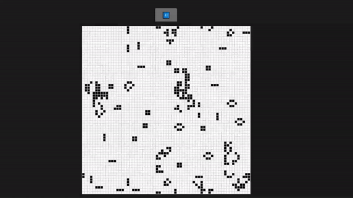

# Wasm Game Of Life
This is an implementation of Conway's Game of Life using Rust and WebAssembly

https://rustwasm.github.io/book/game-of-life/introduction.html
# What I learned
- How to set up a Rust toolchain for compiling to WebAssembly.

- A workflow for developing polyglot programs made from Rust, WebAssembly, JavaScript, HTML, and CSS.

- How to design APIs to take maximum advantage of both Rust and WebAssembly's - strengths and also JavaScript's strengths.

- How to debug WebAssembly modules compiled from Rust.

- How to time profile Rust and WebAssembly programs to make them faster.

- How to size profile Rust and WebAssembly programs to make `.wasm` binaries smaller and faster to download over the network.
---
